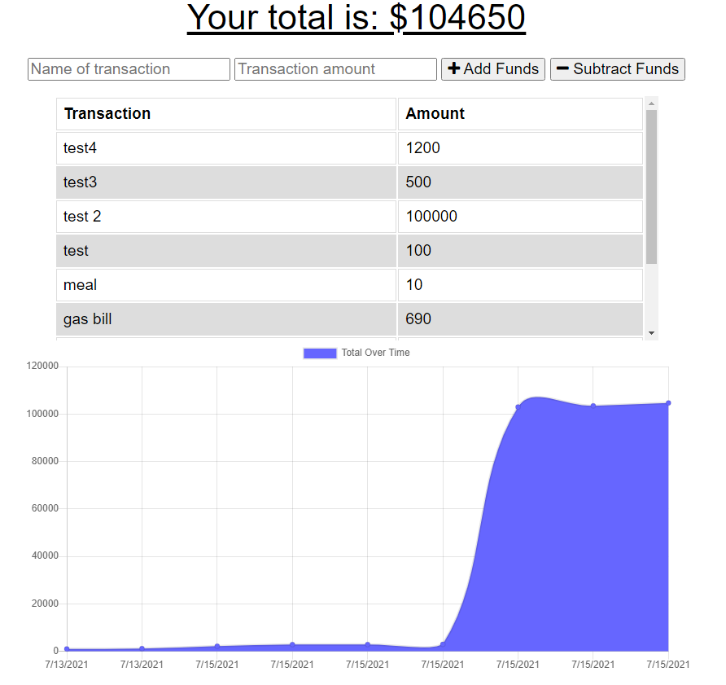

# Summary
The user will be able to add expenses and deposits to their budget with or without a connection. When entering transactions offline, they should populate the total when brought back online.

## Table of Contents
- [User Story](#userstory)
- [Business Context](#businesscontext)
- [Acceptance Criteria](#acceptancecriteria)
- [Technology Used](#technologyused)
- [Screenshot](#screenshot)

## User Story

* AS AN avid traveller
I WANT to be able to track my withdrawals and deposits with or without a data/internet connection
SO THAT my account balance is accurate when I am traveling

## Business Context

Adding functionality to our existing Budget Tracker application to allow for offline access and functionality.

## Acceptance Criteria

Offline Functionality:

  * Enter deposits offline

  * Enter expenses offline

When brought back online:

  * Offline entries should be added to tracker.

## Technology Used

  * MongoDB
  * Mongoose
  * Express.js
  * Node.js
  * IndexedDB

## Screenshot
